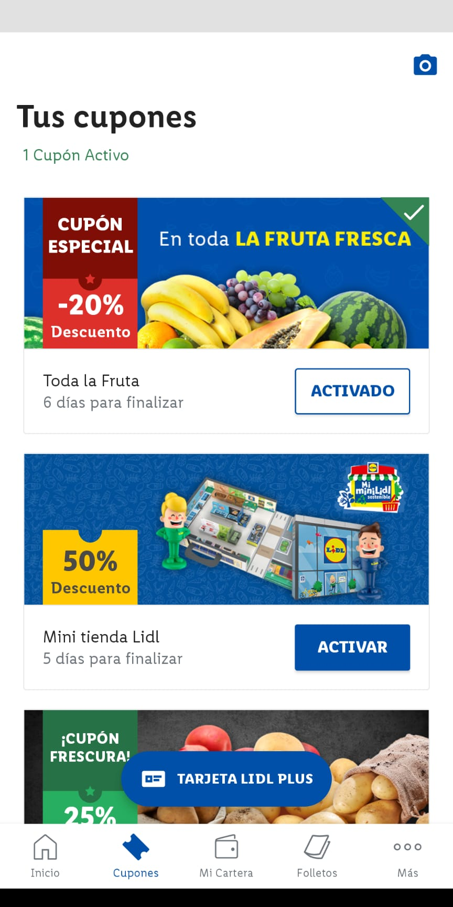
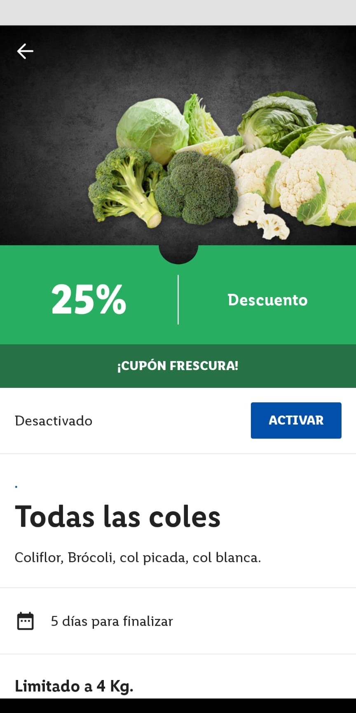
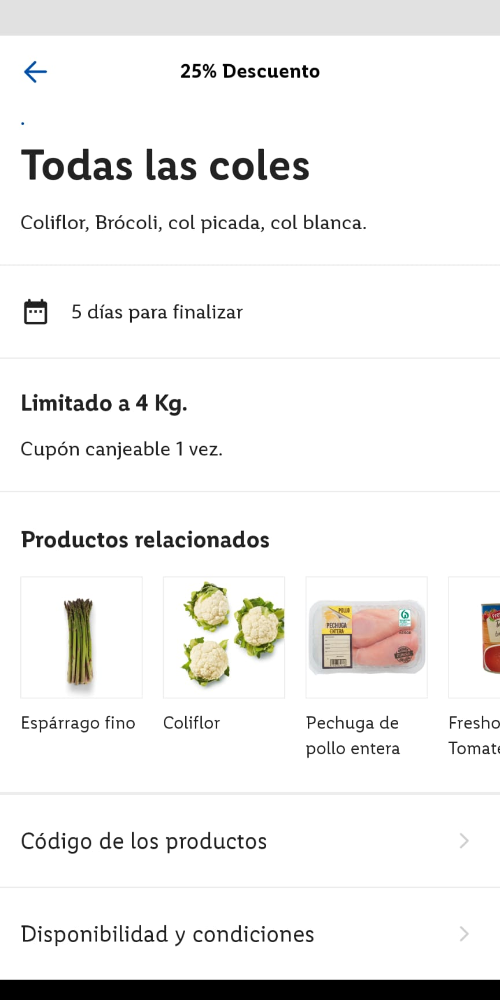

# Coupon application

Android app to deliver coupons to save some money while shopping :purse:

The project will be managed from the
[project board](https://github.com/brunoescalona/CouponsApp/projects/1)

## Requirements

### Coupon list



The coupon list should display all the coupon list provided by the service.

Each item should display:
- An image
- A title
- The remaining time to claim the coupon
- A button to activate or deactivate it

It should display too a collapsable toolbar with the number of active coupons.


### Coupon detail





The coupon detail should display all detail information provided by the service.

Each item should display:

- An image
- A discount coupon
- The state with a button to activate or deactivate it
- A title
- A description
- Application of the coupon
- Related products
- Code of the available products
- Availability and conditions

### API definition

#### List of coupons

It will be used to fetch all the coupons available

##### Method
`GET`

##### End point
`/coupons`

##### Successful response
``` json
{
   "coupons":[
      {
         "id":0,
         "title":"Example title",
         "description":"Example description",
         "image_url":"https://www.example.com/image.jpg",
         "is_enabled":false,
         "end_date":"2012-04-23T18:25:43.511Z",
         "limits":{
            "title":"Limited to 4kg",
            "description":"Can be used only once"
         },
         "related_products":[
            {
               "name":"Apple",
               "icon_url":"https://www.example.com/icon_apple.jpg"
            },
            {
               "name":"Banana",
               "icon_url":"https://www.example.com/icon_banana.jpg"
            }
         ],
         "product_code":123456,
         "conditions":"Here you can see all the conditions"
      },
      { "id":1 },
      { "id":2 }
   ]
}
```
Not mandatory fields `related_products`


####  Change state of the coupon

Used to change the state of the coupon, if the coupon is enabled it will be changed to disabled and the other way around.

##### Method
`PUT`

##### End point
`/coupons/{coupon-id}/state`

##### Successful response
``` json
{
   "id":0,
   "title":"Example title",
   "description":"Example description",
   "image_url":"https://www.example.com/image.jpg",
   "is_enabled":true,
   "end_date":"2012-04-23T18:25:43.511Z",
   "limits":{
      "title":"Limited to 4kg",
      "description":"Can be used only once"
   },
   "related_products":[
      {
         "name":"Apple",
         "icon_url":"https://www.example.com/icon_apple.jpg"
      },
      {
         "name":"Banana",
         "icon_url":"https://www.example.com/icon_banana.jpg"
      }
   ],
   "product_code":123456,
   "conditions":"Here you can see all the conditions"
}
```

Not mandatory fields `related_products`
